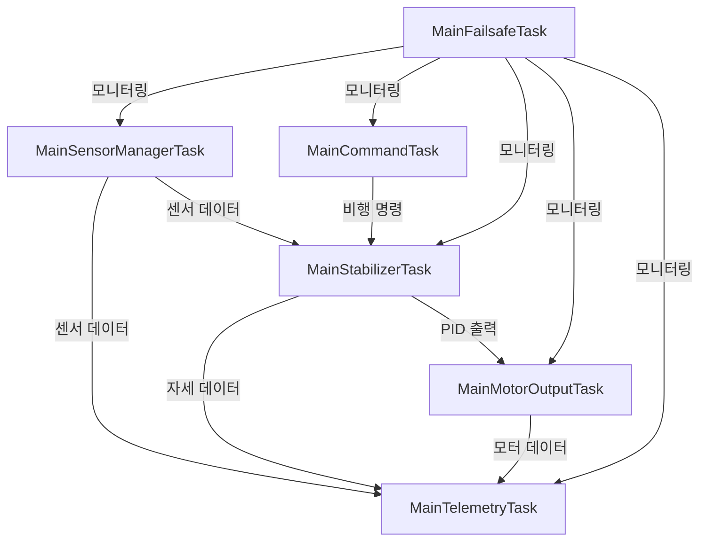

# 드론 제어 시스템 아키텍처

이 문서는 `drone-task.ino`에 구현된 드론 제어 시스템에 대한 개요를 제공합니다. 이 시스템은 ESP32에서 FreeRTOS를 사용하여 구축되었으며, 모듈형 태스크 기반 아키텍처를 따릅니다.

## 시스템 개요

드론 제어 시스템은 여러 주요 태스크로 구성되어 있으며, 각 태스크는 드론 운영의 특정 측면을 담당합니다. 이 태스크들은 뮤텍스로 보호되는 공유 메모리를 통해 통신하며, 동기화를 위해 FreeRTOS 기본 요소들을 사용합니다.

## 주요 태스크

### 1. MainSensorManagerTask (센서 관리 태스크)
**우선순위**: 1  
**코어**: 1  
**설명**: 모든 센서 데이터 수집 및 처리를 관리합니다.

#### 하위 태스크:
- **SubSensorManager_IMUTask**: IMU 센서 데이터(가속도계, 자이로스코프)를 시뮬레이션합니다.
- **SubSensorManager_BarometerTask**: 기압계/고도 데이터를 시뮬레이션합니다.
- **SubSensorManager_GPSTask**: GPS 위치 및 속도 데이터를 시뮬레이션합니다.
- **SubSensorManager_MagnetometerTask**: 지자계/나침반 데이터를 시뮬레이션합니다.
- **SubSensorManager_MonitorTask**: 주기적으로 센서 데이터를 JSON 형식으로 출력합니다.

### 2. MainStabilizerTask (안정화 태스크)
**우선순위**: 3  
**코어**: 1  
**설명**: PID 제어기를 사용한 비행 안정화 시스템을 구현합니다.

#### 하위 태스크:
- **SubStabilizer_AttitudeEstimatorTask**: 센서 데이터로부터 드론의 자세를 추정합니다.
- **SubStabilizer_PIDRollTask**: 롤 축 안정화를 위한 PID 제어기를 구현합니다.
- **SubStabilizer_PIDPitchTask**: 피치 축 안정화를 위한 PID 제어기를 구현합니다.
- **SubStabilizer_PIDYawTask**: 요 축 안정화를 위한 PID 제어기를 구현합니다.
- **SubStabilizer_PIDControllerTask**: PID 출력을 모터 제어 신호로 변환합니다.

### 3. MainMotorOutputTask (모터 제어 태스크)
**우선순위**: 4  
**코어**: 1  
**설명**: 안정화 명령에 기반하여 모터 출력을 제어합니다.

### 4. MainCommandTask (명령 처리 태스크)
**우선순위**: 2  
**코어**: 0  
**설명**: 고수준 비행 명령(이륙, 호버링, 착륙)을 처리합니다.

### 5. MainTelemetryTask (텔레메트리 태스크)
**우선순위**: 1  
**코어**: 0  
**설명**: 지상국으로의 텔레메트리 데이터 전송을 처리합니다.

### 6. MainFailsafeTask (안전 장치 태스크)
**우선순위**: 5  
**코어**: 0  
**설명**: 시스템 상태를 모니터링하고 필요한 경우 안전 장치 절차를 실행합니다.

## 태스크 흐름

## 데이터 구조

### 공유 변수
- **sensorData**: 모든 센서 판독값 포함 (IMU, 기압계, GPS, 지자계)
- **attitude**: 현재 추정된 자세 (롤, 피치, 요)
- **pidOutput**: 각 축에 대한 PID 제어기 출력값
- **motors**: 모터 출력값 (m1, m2, m3, m4)

### 동기화 기본 요소
- **mutexSensorData**: 센서 데이터 접근 보호
- **mutexAttitude**: 자세 데이터 접근 보호
- **mutexPIDOutput**: PID 출력 접근 보호
- **mutexMotors**: 모터 출력 접근 보호
- **commandQueue**: 비행 명령을 위한 큐
- **flightEvents**: 비행 관련 이벤트를 위한 이벤트 그룹

## 시스템 특성

- **실시간 성능**: 중요한 태스크는 더 높은 우선순위로 코어 1에서 실행
- **결함 허용**: 워치독 타이머 및 안전 장치 메커니즘
- **모듈성**: 각 하위 시스템이 자체 태스크로 격리됨
- **디버깅**: 광범위한 모니터링 및 충돌 보고 기능

## 모니터링 및 디버깅

시스템에는 다음과 같은 디버깅 기능이 포함되어 있습니다:
- 스택 사용량 모니터링
- 태스크 상태 보고
- 스택 트레이스가 포함된 충돌 보고
- 주기적인 시스템 상태 출력

## 통신

- **WiFi**: 텔레메트리 및 지상국 통신에 사용
- **HTTP**: 지상국과의 JSON 기반 통신
- **시리얼**: 디버그 출력 및 모니터링

## 안전 기능

- 태스크 모니터링을 위한 워치독 타이머
- 치명적 오류에 대한 안전 장치 메커니즘
- 리소스 사용량 모니터링
- 스택 오버플로우 방지
