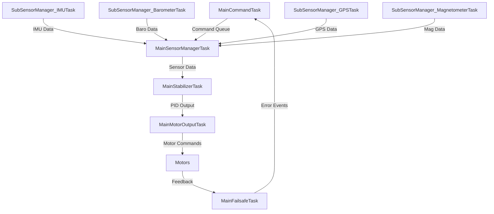

# Drone Simulation System (DRONESIM)

## Overview
This document provides a comprehensive overview of the drone simulation system implemented for ESP32. The system is designed to simulate a quadcopter's flight control system with multiple concurrent tasks for sensor management, stabilization, motor control, and command handling.

## System Architecture

The system is built around FreeRTOS on ESP32, utilizing multiple tasks to achieve concurrent operation. The architecture follows a modular design with clear separation of concerns.

### Core Components

1. **Main Tasks**
   - `MainSensorManagerTask`: Manages all sensor data collection and processing
   - `MainStabilizerTask`: Implements PID control for flight stabilization
   - `MainMotorOutputTask`: Controls motor outputs based on PID calculations
   - `MainCommandTask`: Handles incoming flight commands
   - `MainFailsafeTask`: Monitors system health and triggers failsafe procedures

2. **Sensor Sub-Tasks**
   - `SubSensorManager_IMUTask`: Simulates IMU data (accelerometer, gyroscope)
   - `SubSensorManager_BarometerTask`: Simulates barometric pressure/altitude data
   - `SubSensorManager_GPSTask`: Simulates GPS position data
   - `SubSensorManager_MagnetometerTask`: Simulates magnetometer (compass) data

3. **Data Structures**
   - `PIDOutput`: Hovers roll, pitch, yaw, and altitude control outputs
   - `Attitude`: Tracks current orientation (pitch, roll, yaw) and altitude
   - `SensorData`: Aggregates all sensor readings
   - `MotorOutput`: Controls individual motor speeds
   - `PIDController`: Implements PID control algorithm

## Task Communication



## Flight Control Flow

1. **Command Reception**
   - Commands received via serial interface or network
   - Added to command queue for processing
   - Handled by `MainCommandTask`

2. **Sensor Data Collection**
   - Multiple sensor tasks collect data in parallel
   - Data is protected by mutexes for thread safety
   - Aggregated by `MainSensorManagerTask`

3. **Stabilization**
   - `MainStabilizerTask` reads current attitude and target
   - PID controllers calculate required corrections
   - Outputs motor speed adjustments

4. **Motor Control**
   - `MainMotorOutputTask` receives PID outputs
   - Mixes controls for quadcopter movement
   - Applies motor speed limits and safety checks

## Key Features

- **Multi-tasking**: Utilizes FreeRTOS for concurrent operations
- **Thread Safety**: Mutexes protect shared resources
- **Modular Design**: Clear separation between components
- **Simulation Ready**: Simulated sensor data for testing
- **Flight Modes**: Supports multiple flight phases (IDLE, TAKEOFF, HOVER, LAND)

## Configuration

### PID Tuning
```cpp
// Default PID values
PIDController pitchPID = {2.0f, 0.5f, 1.0f};  // KP, KI, KD
PIDController rollPID = {2.0f, 0.5f, 1.0f};
PIDController yawPID = {1.0f, 0.1f, 0.5f};
PIDController altPID = {10.0f, 0.1f, 5.0f};
```

### Flight Parameters
- Max climb rate: 1.0 m/s
- Max tilt angle: 30 degrees
- Altitude hold tolerance: ±0.1m

## Usage

1. Upload the firmware to ESP32
2. Connect via serial monitor (115200 baud)
3. Send commands:
   - `TAKEOFF`: Start takeoff sequence
   - `HOVER`: Maintain current position
   - `LAND`: Begin landing sequence
   - `EMERGENCY_STOP`: Immediately stop all motors

## Monitoring

System prints status updates including:
- Task status and CPU usage
- Current flight phase
- Sensor readings
- PID outputs
- Motor commands

## Dependencies

- Arduino Framework
- FreeRTOS
- ESP32 Board Support Package
- ArduinoJSON (for network communication)

## Safety Features

- Motor arming sequence
- Emergency stop command
- Battery voltage monitoring
- Communication watchdog
- Automatic failsafe on signal loss

## Future Enhancements

- Waypoint navigation
- Computer vision integration
- Advanced flight modes
- Remote telemetry via WiFi
- Automated testing framework
