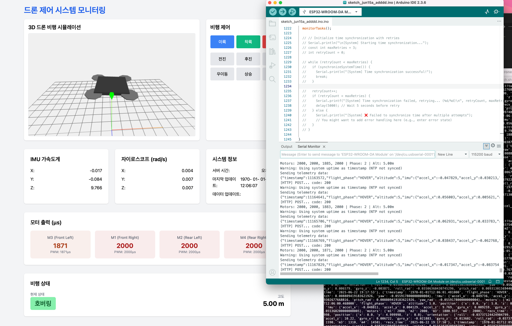

# ESP32 데이터 수집/모니터링 서버 (Flask + 웹)

ESP32에서 HTTP POST로 전송되는 JSON 데이터를 수신하여,

- 터미널에 출력하고
- 웹페이지에서 실시간으로 자동 갱신되는 표로 모니터링할 수 있는
  파이썬(Flask) 기반 서버입니다.

---

## 실행 방법

1. **필요 패키지 설치** (최초 1회)

   ```bash
   pip install flask flask_cors
   # 또는 pyproject.toml/uv/poetry 등 환경에 맞게 설치
   ```

2. **서버 실행**

   ```bash
   python drone.py
   # uv run python drone.py

   python main-xxx.py
   # 또는 uv run python main-xxx.py
   ```

3. **웹페이지 접속**

   - 브라우저에서 `http://<PC_IP>:5003/` 접속
   - 최신 20개의 ESP32 데이터가 실시간 자동 갱신되어 표로 표시됨

4. **ESP32 연동**
   - ESP32 코드의 `serverURL`을 서버 주소(`http://<PC_IP>:5003/api/data`)로 맞춰주세요.
   - 예시: (코드: main-task-led-buzzer.ino)
     ```cpp
     const char* serverURL = "http://192.168.123.111:5003/api/data";
     ```
   - ESP32가 HTTP POST로 아래와 같은 JSON을 전송합니다.
   - arduinojson 라이브러리 사용합니다. 라이브러리 설치해줘야 합니다.
     ```json
     {
       "timestamp": 1234567,
       "random_number": 42,
       "device_id": "ESP32_TaskYo",
       "core_id": 0
     }
     ```

---

## 전송/수신 데이터 구조 예시

```json
{
  "timestamp": 1234567,
  "random_number": 42,
  "device_id": "ESP32_TaskYo",
  "core_id": 0
}
```

- 각 데이터는 수신 시각과 함께 웹페이지에 표시됩니다.
- 모니터링 웹페이지: http://192.168.123.111:5003/

---

## 주요 기능

- ESP32에서 HTTP POST로 들어오는 JSON 데이터를 실시간으로 저장/표시
- 웹페이지(/)에서 최신 20개 데이터 자동 갱신
- `/api/latest`로 JSON 데이터 목록 조회 가능 (프론트엔드 등 연동 가능)
- 서버는 5003번 포트에서 실행됩니다. 포트가 다를 경우 코드와 주소를 맞춰야 합니다.
- 방화벽/네트워크 환경에서 5003 포트가 열려 있어야 ESP32와 통신 및 웹 접속이 가능합니다.
- Flask 개발 서버는 테스트/개발용입니다. 실제 서비스용은 WSGI 서버(gunicorn 등) 사용을 권장합니다.

---

## 구현 내용

### 호버링



### RTOS 프로그래밍 on ESP32 보드


